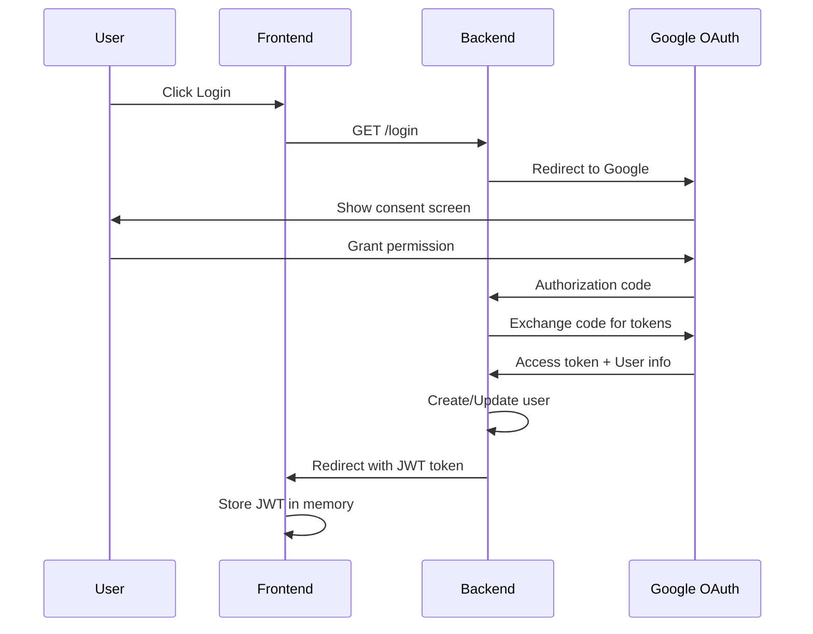
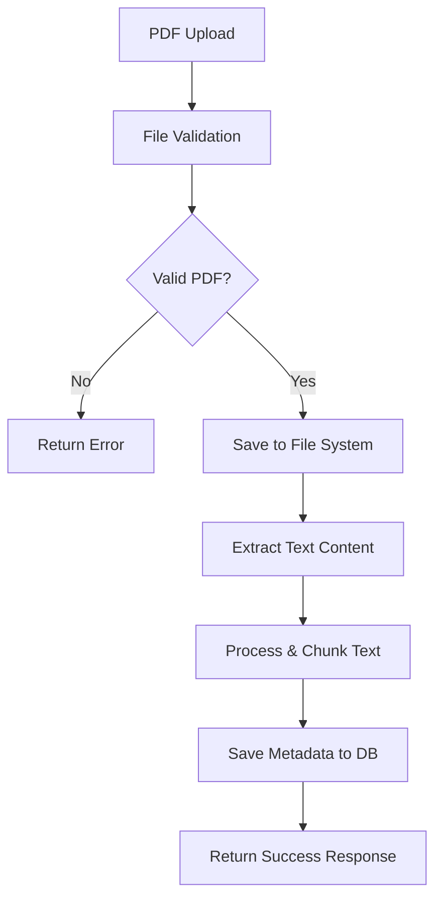
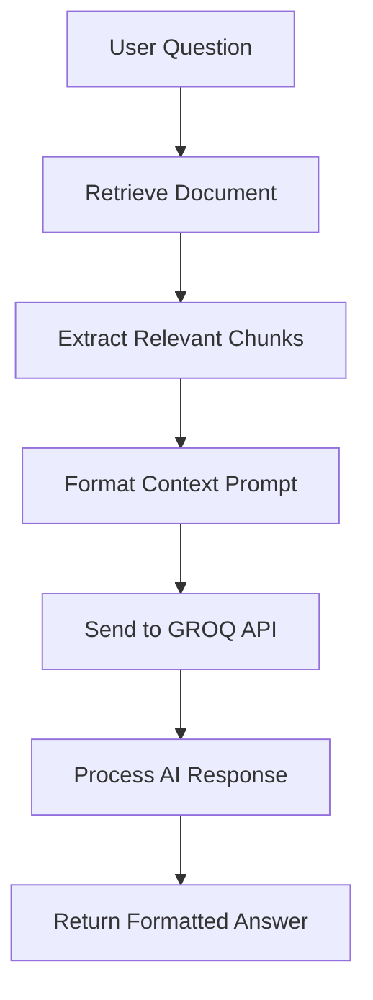
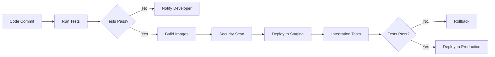

# PDF Q&A Application - High Level Design (HLD)

## 1. System Overview

### 1.1 Purpose
The PDF Q&A Application is a full-stack web application that enables users to upload PDF documents and interact with them through an AI-powered question-answering system. The system provides secure document management with natural language processing capabilities.

### 1.2 Scope
- Secure user authentication via Google OAuth 2.0
- PDF document upload, storage, and management
- AI-powered question answering using GROQ API
- Document lifecycle management with CRUD operations
- Responsive web interface for optimal user experience

### 1.3 Key Requirements
- **Functional**: PDF upload, text extraction, AI Q&A, document management
- **Non-Functional**: Security, scalability, performance, maintainability
- **Quality Attributes**: Availability (99.9%), Response time (<2s), Concurrent users (100+)

## 2. Architecture Overview

### 2.1 System Architecture Pattern
The application follows a **3-tier architecture** with clear separation of concerns:

```
┌─────────────────┐    ┌─────────────────┐    ┌─────────────────┐
│  Presentation   │    │   Application   │    │      Data       │
│     Layer       │◄──►│     Layer       │◄──►│     Layer       │
│   (React SPA)   │    │  (FastAPI)      │    │  (SQLite/FS)    │
└─────────────────┘    └─────────────────┘    └─────────────────┘
```

### 2.2 Deployment Architecture

```
Internet
    │
    ▼
┌─────────────────────────────────────────┐
│            Load Balancer                │
│         (Future Enhancement)           │
└─────────────────┬───────────────────────┘
                  │
    ┌─────────────┼─────────────┐
    ▼             ▼             ▼
┌─────────┐  ┌─────────┐  ┌─────────┐
│Frontend │  │Backend  │  │External │
│React SPA│  │FastAPI  │  │Services │
│Port 5173│  │Port 8000│  │(OAuth,  │
└─────────┘  └─────────┘  │ GROQ)   │
                          └─────────┘
```

## 3. Component Architecture

### 3.1 Frontend Architecture (React)

```
src/
├
└── App.jsx            # Main application component
```

### 3.2 Backend Architecture (FastAPI)

```
app/
├── main.py             # Application entry point
├── models.py
├── schemas.py
├── database.py
├── services/           # Business logic layer
│   ├── __init__.py
│   ├── qa_engine.py
│   ├── pdf_handler.py
├── crud.py
```

## 4. Detailed Component Design

### 4.1 Authentication System

#### 4.1.1 OAuth 2.0 Flow


#### 4.1.2 JWT Token Management
- **Token Structure**: Header.Payload.Signature
- **Payload**: User ID, username, expiration time
- **Storage**: Memory-based (not localStorage for security)
- **Refresh Strategy**: Re-authentication on expiry

### 4.2 PDF Processing Pipeline



#### 4.2.1 Text Extraction Strategy
- **Primary**: PyMuPDF for performance
- **Fallback**: pdfplumber for complex layouts
- **Chunking**: 1000-character chunks with 200-character overlap
- **Preprocessing**: Remove excessive whitespace, normalize text

### 4.3 AI Question-Answering System

#### 4.3.1 Query Processing Flow


#### 4.3.2 Context Management
- **Model**: llama3-8b-8192 via GROQ API
- **Context Window**: 8192 tokens maximum
- **Prompt Template**:
  ```
  Context: {document_text}
  Question: {user_question}
  Please provide a comprehensive answer based solely on the provided context.
  ```

## 5. Data Architecture

### 5.1 Database Schema

```sql
-- Users table
CREATE TABLE users (
    id INTEGER PRIMARY KEY AUTOINCREMENT,
    username VARCHAR(255) UNIQUE NOT NULL,
    email VARCHAR(255) UNIQUE NOT NULL,
    full_name VARCHAR(255),
    created_at TIMESTAMP DEFAULT CURRENT_TIMESTAMP,
    updated_at TIMESTAMP DEFAULT CURRENT_TIMESTAMP
);

-- Documents table
CREATE TABLE documents (
    id INTEGER PRIMARY KEY AUTOINCREMENT,
    user_id INTEGER NOT NULL,
    filename VARCHAR(255) NOT NULL,
    original_filename VARCHAR(255) NOT NULL,
    file_path VARCHAR(500) NOT NULL,
    file_size INTEGER NOT NULL,
    upload_date TIMESTAMP DEFAULT CURRENT_TIMESTAMP,
    text_content TEXT,
    FOREIGN KEY (user_id) REFERENCES users (id) ON DELETE CASCADE
);

-- Chat history (future enhancement)
CREATE TABLE chat_history (
    id INTEGER PRIMARY KEY AUTOINCREMENT,
    user_id INTEGER NOT NULL,
    document_id INTEGER NOT NULL,
    question TEXT NOT NULL,
    answer TEXT NOT NULL,
    created_at TIMESTAMP DEFAULT CURRENT_TIMESTAMP,
    FOREIGN KEY (user_id) REFERENCES users (id) ON DELETE CASCADE,
    FOREIGN KEY (document_id) REFERENCES documents (id) ON DELETE CASCADE
);
```

### 5.2 File Storage Strategy
- **Development**: Local file system in `uploads/` directory
- **Production**: Cloud storage (S3) with CDN integration
- **Naming Convention**: `{user_id}/{timestamp}_{original_filename}`
- **Security**: File type validation, size limits, virus scanning

## 6. API Design

### 6.1 RESTful Endpoints

| Method | Endpoint | Description | Request Body | Response |
|--------|----------|-------------|--------------|----------|
| GET | `/login` | Initiate OAuth flow | - | Redirect URL |
| GET | `/auth` | OAuth callback | - | JWT Token |
| POST | `/upload/` | Upload PDF | multipart/form-data | Document metadata |
| GET | `/documents/` | List user documents | - | Document array |
| GET | `/documents/{id}` | Get document details | - | Document object |
| POST | `/ask/` | Ask question | JSON: question, document_id | AI response |
| DELETE | `/documents/{id}` | Delete document | - | Success status |
| DELETE | `/documents/cleanup/` | Clean orphaned files | - | Cleanup report |

### 6.2 Request/Response Schemas

#### Document Upload Response
```json
{
  "id": 123,
  "filename": "document.pdf",
  "original_filename": "My Document.pdf",
  "file_size": 2048576,
  "upload_date": "2025-07-01T10:30:00Z",
  "text_extracted": true
}
```

#### Question Request
```json
{
  "document_id": 123,
  "question": "What is the main topic of this document?"
}
```

#### AI Response
```json
{
  "answer": "Based on the document content, the main topic is...",
  "confidence": 0.95,
  "processing_time": 1.2,
  "document_title": "My Document.pdf"
}
```

## 7. Security Architecture

### 7.1 Security Layers

```
┌─────────────────────────────────────────┐
│          Application Security           │
├─────────────────────────────────────────┤
│ • Input Validation & Sanitization      │
│ • SQL Injection Prevention             │
│ • XSS Protection                       │
│ • CSRF Protection                      │
└─────────────────────────────────────────┘
┌─────────────────────────────────────────┐
│        Authentication & Authorization   │
├─────────────────────────────────────────┤
│ • Google OAuth 2.0                     │
│ • JWT Token Management                 │
│ • User Session Handling                │
│ • Resource Access Control              │
└─────────────────────────────────────────┘
┌─────────────────────────────────────────┐
│           Transport Security            │
├─────────────────────────────────────────┤
│ • HTTPS/TLS 1.3                        │
│ • CORS Configuration                   │
│ • Security Headers                     │
│ • API Rate Limiting                    │
└─────────────────────────────────────────┘
```

### 7.2 Security Controls

#### 7.2.1 Authentication Security
- **OAuth 2.0**: Secure third-party authentication
- **JWT**: Stateless token with expiration
- **Token Storage**: Memory-only, no persistent storage
- **Session Management**: Automatic logout on expiry

#### 7.2.2 Authorization Security
- **Resource Isolation**: Users can only access their documents
- **API Guards**: All endpoints require valid JWT
- **Role-Based Access**: Prepared for future RBAC implementation
- **Audit Trail**: All operations logged with user context

#### 7.2.3 Data Security
- **Input Validation**: Pydantic schemas for all inputs
- **File Validation**: MIME type and extension checking
- **SQL Injection**: SQLAlchemy ORM with parameterized queries
- **Data Encryption**: Prepared for at-rest encryption

#### 7.2.4 Infrastructure Security
- **CORS**: Restricted origin configuration
- **Rate Limiting**: API endpoint protection
- **Error Handling**: No sensitive information leakage
- **Security Headers**: HSTS, CSP, X-Frame-Options

## 8. Performance & Scalability

### 8.1 Performance Optimizations

#### 8.1.1 Backend Optimizations
- **Database**: Proper indexing on frequently queried columns
- **File Processing**: Streaming for large PDF files
- **Caching**: In-memory caching for frequently accessed documents
- **Connection Pooling**: Database connection optimization

#### 8.1.2 Frontend Optimizations
- **Code Splitting**: Lazy loading of components
- **Asset Optimization**: Minification and compression
- **Caching**: Browser caching for static assets
- **Bundle Size**: Tree shaking and dead code elimination

### 8.2 Scalability Strategy

#### 8.2.1 Horizontal Scaling
```
┌─────────────────┐    ┌─────────────────┐
│  Load Balancer  │    │  Load Balancer  │
└─────────┬───────┘    └─────────┬───────┘
          │                      │
    ┌─────┼─────┐          ┌─────┼─────┐
    ▼     ▼     ▼          ▼     ▼     ▼
┌─────┐┌─────┐┌─────┐  ┌─────┐┌─────┐┌─────┐
│API 1││API 2││API 3│  │UI 1 ││UI 2 ││UI 3 │
└─────┘└─────┘└─────┘  └─────┘└─────┘└─────┘
```

#### 8.2.2 Database Scaling
- **Read Replicas**: For read-heavy workloads
- **Sharding**: User-based partitioning
- **Migration Path**: SQLite → PostgreSQL → Distributed DB

#### 8.2.3 File Storage Scaling
- **Cloud Storage**: S3 with CDN integration
- **Distributed Storage**: Multiple availability zones
- **Caching**: Edge caching for frequently accessed files

## 9. Monitoring & Observability

### 9.1 Monitoring Strategy

#### 9.1.1 Application Metrics
- **Response Time**: API endpoint performance
- **Error Rate**: 4xx/5xx error tracking
- **Throughput**: Requests per second
- **User Activity**: Document uploads, questions asked

#### 9.1.2 System Metrics
- **CPU/Memory Usage**: Resource utilization
- **Database Performance**: Query execution time
- **File System**: Storage usage and I/O metrics
- **Network**: Bandwidth and latency

#### 9.1.3 Business Metrics
- **User Engagement**: Active users, session duration
- **Feature Usage**: Most used features, user flows
- **Document Analytics**: Upload patterns, popular documents
- **AI Performance**: Question accuracy, response satisfaction

### 9.2 Logging Strategy

#### 9.2.1 Structured Logging
```json
{
  "timestamp": "2025-07-01T10:30:00Z",
  "level": "INFO",
  "service": "pdf-qa-api",
  "user_id": "user123",
  "endpoint": "/ask/",
  "method": "POST",
  "response_time": 1.2,
  "status_code": 200,
  "message": "Question processed successfully"
}
```

#### 9.2.2 Log Categories
- **Access Logs**: All API requests and responses
- **Error Logs**: Exception details and stack traces
- **Security Logs**: Authentication and authorization events
- **Business Logs**: User actions and system events

## 10. Deployment & DevOps

### 10.1 Deployment Strategy

#### 10.1.1 Environment Configuration
```
Development → Staging → Production
     │           │          │
     ▼           ▼          ▼
  Local DB    Test DB    Prod DB
  Local FS    S3 Test    S3 Prod
  Dev Keys    Test Keys  Prod Keys
```

#### 10.1.2 Docker Configuration
```dockerfile
# Multi-stage build for production optimization
FROM node:18-alpine AS frontend-build
WORKDIR /app/frontend
COPY frontend/package*.json ./
RUN npm ci --only=production
COPY frontend/ ./
RUN npm run build

FROM python:3.11-slim AS backend
WORKDIR /app
COPY requirements.txt ./
RUN pip install --no-cache-dir -r requirements.txt
COPY app/ ./app/
COPY --from=frontend-build /app/frontend/dist ./static/
EXPOSE 8000
CMD ["uvicorn", "app.main:app", "--host", "0.0.0.0", "--port", "8000"]
```

### 10.2 CI/CD Pipeline



## 11. Risk Assessment & Mitigation

### 11.1 Technical Risks

| Risk | Impact | Probability | Mitigation |
|------|--------|-------------|------------|
| AI API Rate Limits | High | Medium | Implement caching, fallback responses |
| Large File Processing | Medium | High | Streaming, size limits, timeout handling |
| OAuth Service Outage | High | Low | Graceful degradation, status page |
| Database Corruption | High | Low | Regular backups, replication |

### 11.2 Security Risks

| Risk | Impact | Probability | Mitigation |
|------|--------|-------------|------------|
| Data Breach | High | Low | Encryption, access controls, auditing |
| PDF Malware | Medium | Medium | File scanning, sandboxed processing |
| JWT Token Theft | Medium | Low | Short expiry, secure transmission |
| DDoS Attack | Medium | Medium | Rate limiting, CDN protection |

### 11.3 Business Risks

| Risk | Impact | Probability | Mitigation |
|------|--------|-------------|------------|
| High AI Costs | Medium | High | Usage monitoring, cost optimization |
| Scalability Issues | High | Medium | Performance testing, scaling strategy |
| User Data Loss | High | Low | Backup strategy, disaster recovery |
| Service Downtime | Medium | Medium | Health checks, auto-recovery |

## 12. Future Enhancements

### 12.1 Short-term (3-6 months)
- **Real-time Chat**: WebSocket integration for live Q&A
- **Document Sharing**: Team collaboration features
- **Advanced Analytics**: Usage dashboards and insights
- **Mobile Optimization**: Progressive Web App (PWA)

### 12.2 Medium-term (6-12 months)
- **Multi-model AI**: Support for multiple AI providers
- **Document Templates**: Pre-defined document types
- **Advanced Search**: Full-text search across documents
- **API Rate Optimization**: Intelligent caching strategies

### 12.3 Long-term (12+ months)
- **Enterprise Features**: SSO, RBAC, audit logging
- **Mobile Applications**: Native iOS/Android apps
- **Microservices Architecture**: Service decomposition
- **AI Model Training**: Custom model fine-tuning

## 13. Conclusion

This High-Level Design provides a comprehensive blueprint for building a scalable, secure, and maintainable PDF Q&A application. The architecture emphasizes:

- **Security First**: Comprehensive security controls at every layer
- **Scalability**: Designed for horizontal scaling and growth
- **Maintainability**: Clean architecture with separation of concerns
- **Performance**: Optimized for speed and efficiency
- **User Experience**: Intuitive interface with robust error handling

The modular design allows for incremental development and deployment, ensuring the system can evolve with changing requirements while maintaining stability and performance.

---

**Document Version**: 1.0  
**Last Updated**: July 1, 2025  
**Author**: System Architecture Team  
**Review Status**: Approved for Implementation